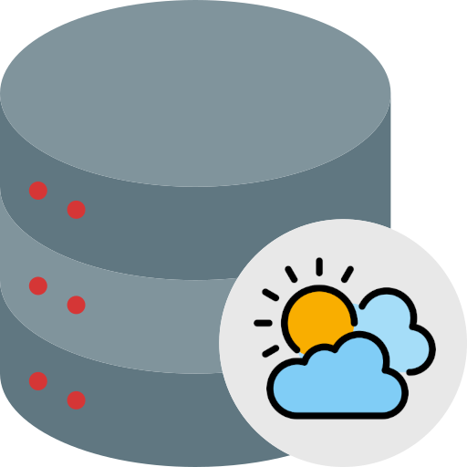

[![Swift Version][swift-image]][swift-url]
[![License][license-image]][license-url]
[![PRs Welcome][pr-welcome-image]][pr-welcome-url]

# Table of Contents
1. [Description](#description)
2. [Getting started](#getting-started)
3. [Structure](#structure)
4. [Running the tests](#running-the-tests)
5. [Deployment](#deployment)
6. [Dependencies](#dependencies)
7. [Workflow](#workflow)
8. [Contribute](#Contribute)
9. [Meta](#Meta)

# Weather Repository Package

<br />
<p align="center">
  <a href="https://github.com/marcelomogrovejo/weatherrepopackage">
    
  </a>
  <p align="center">
    A simple repository package project which is a persistence layer to WeatherApp project.
  </p>
</p>

# Description
<p>WeatherRepo package is a simple swift package which is developed to learn 'Swift Package Manager' and 'Repository Pattern'.<br>
The project consists of an API Service which exposes methods like fetch the weather for a specific location.</p>

# Getting started
<p>
1. Make sure you have the Xcode version 14.0 or above installed on your computer.<br>
2. Download the WeatherApp project files from the repository.<br>
3. Open the WeatherApp project in Xcode.<br>
4. Make sure the WeatherRepo Packages is downloaded successfully.<br>
5. Run the active scheme.<br>

You should see a main button that request you to share you location.<br>

# Structure 
* "DataSource": Procotols, error handling and model files.
* "DomainLayer": Api service file that exposes the methods to be used by the apps.

# Running the tests
<p>The WeatherRepo package project can be tested using the built-in framework XCTest.<br>
To start testing the project, you will need to change to the 'WeatherRepoPackageTests' target in your Xcode project, and then just run the tests project.</p>

# Deployment
Keep in mind that deploying an iOS app to the App Store requires having an Apple Developer account.

1. Click on the "Product" menu in Xcode and select "Archive." This will create an archive of your project.
2. Once the archive has been created, select it in the Organizer window and click on the "Validate" button to perform some preliminary tests on the app.
3. Once validation is complete, click on the "Distribute" button and select "Ad Hoc" or "App Store" distribution. 
This will create a signed IPA file that can be installed on iOS devices.
4. Follow the prompts in the distribution wizard to complete the distribution process.
5. Once the distribution is complete, you can use the IPA file to install the app on iOS devices

# Dependencies

# Workflow

* Reporting bugs:<br> 
If you come across any issues while using the WeatherRepo package app, please report them by creating a new issue on the GitHub repository.

* Reporting bugs form: <br> 
```
App version: 1.02
iOS version: 16.1
Description: The api is not getting the appropriate language.
Steps to reproduce: .
```

* Submitting pull requests: <br> 
If you have a bug fix or a new feature you'd like to add, please submit a pull request. Before submitting a pull request, 
please make sure that your changes are well-tested and that your code adheres to the Swift style guide.

* Improving documentation: <br> 
If you notice any errors or areas of improvement in the documentation, feel free to submit a pull request with your changes.

* Providing feedback:<br> 
If you have any feedback or suggestions for the ToDoRepository package project, please let us know by creating a new issue or by sending an email to the project maintainer.

## Contribute

We would love you for the contribution to **WeatherRepoPackage**, check the ``LICENSE`` file for more info.

## Meta

Marcel Mogrovejo – [Porfolio](https://marcelomogrovejo.gitlab.io/my-ios-portfolio/) – marcelo.mogrovejo@gmail.com

Distributed under the MIT license. See ``LICENSE`` for more information.

[https://github.com/marcelomogrovejo/](https://github.com/marcelomogrovejo/)

[swift-image]:https://img.shields.io/badge/swift-5.0-orange.svg
[swift-url]: https://swift.org/
[license-image]: https://img.shields.io/badge/License-MIT-blue.svg
[license-url]: LICENSE
[codebeat-image]: https://codebeat.co/badges/c19b47ea-2f9d-45df-8458-b2d952fe9dad
[codebeat-url]: https://codebeat.co/projects/github-com-vsouza-awesomeios-com
[pr-welcome-image]: https://img.shields.io/badge/PRs-welcome-brightgreen.svg?style=flat-square
[pr-welcome-url]: http://makeapullrequest.com
